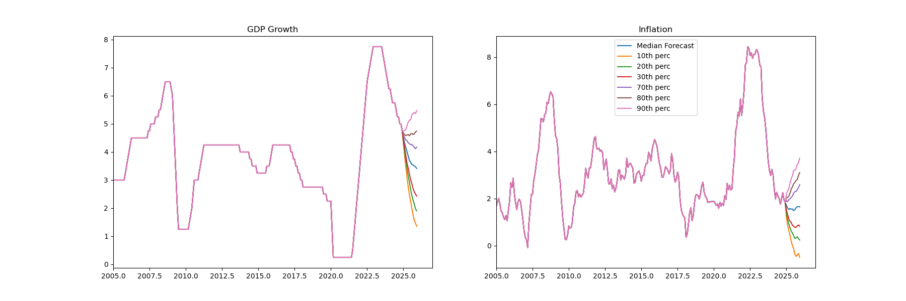

# Gibbs-Sampling-VAR
This repository has applications of the technique of Gibbs sampling and applies it to VAR models using Python and following Andrew Blake and Haroon Mumtaz (2017). It was created as a project for @qlabpucp

